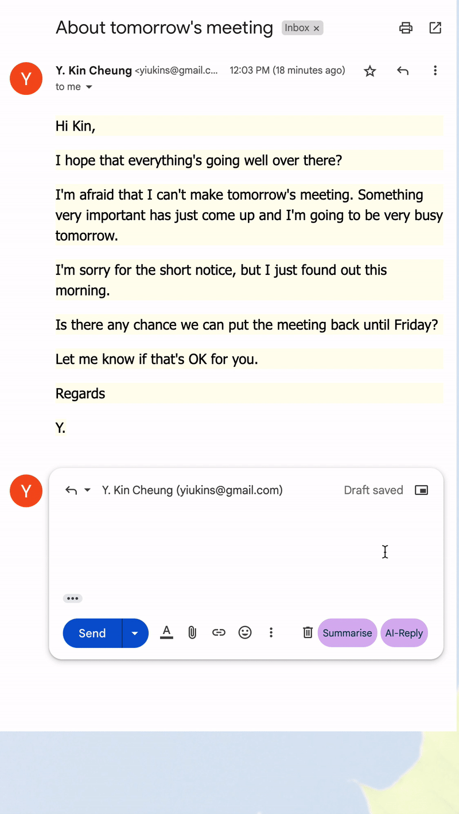

# Temp

  
  <h1 align="center"/>Temp!</h1>

Temp is a chrome extension to assist people in writing their mail when they have less time for the reply

## Installation

To use Chamelo in your chrome browser, follow these steps:
1. Download the source code from this repo or click [here](https://github.com/tannu610/chamelo/archive/refs/heads/main.zip) to download it and then unzip the files.
2. Go to google chrome and then click on the extensions icon 
. Alternatively, you can go to settings and then select extensions from the left tab.
3. Enable the developer mode from the developer mode toogle button the top-right 
.
4. Click on load unpacked and select the folder of the unzipped the content 
.
5. That's it! Now simply click on Chamelo from your extensions to run it.

## Features

Temp offers a number of features to enhance your web experience. The features include:

01. Compose AI --> Compose From Points Write Professional Emails From Notes. You Get Work Done In Only 20% Of Normal Time.

02. Summarise --> Summarize Large Emails Into Points, Precisely!

03. AI Reply -->Taking Auto Reply To The Next Level. AI Choose Right Words For You Depending On Your Input And The Situation

## Permissions
Permissions include tabs and active tabs which helps to manipulate the styles of the web page. **NO DATA IS USED BY US.**

